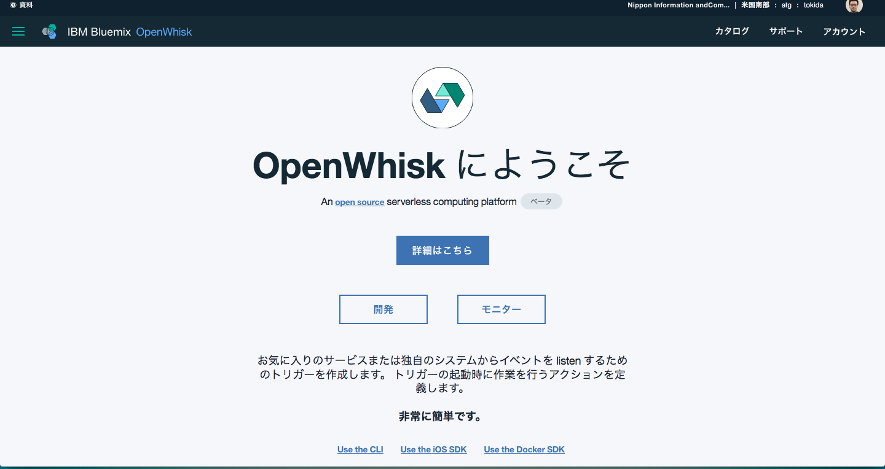

# Cloudantに登録されたデータをSlackで通知する

今回のハンズオンでは、Cloudantに新しい文章が登録されると自動的にSlackに通知する動きを通じてOpenWhiskの動作を学びます。Cloudant上で発生した変化をOpenWhisk側で検知するための仕組みをFeedとよび、Feedから呼び出されるSlackへ通知する機能をActionと呼びます。このハンズオンではFeed/Action/Packageと言ったOpenWhiskで必要となる機能を使います。

### 前提

* Bluemixのアカウントを所有していること
* wskコマンドが導入されていること
* Slackにアカウントを所有していること

## Actionの作成

